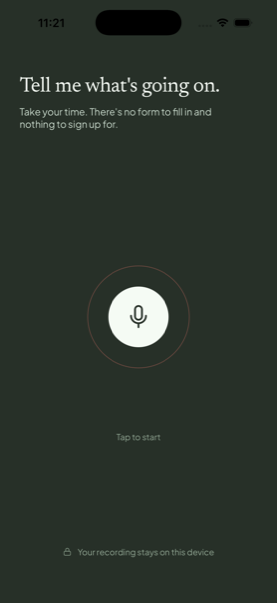
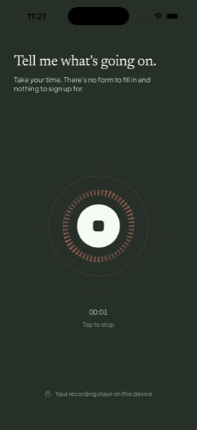
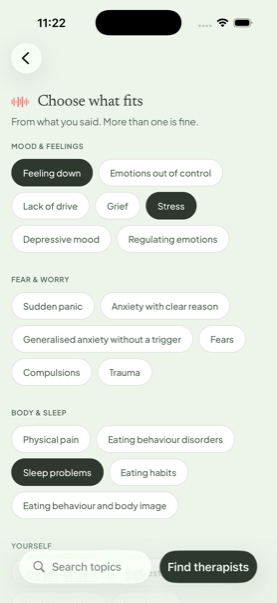
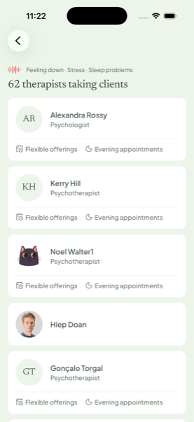
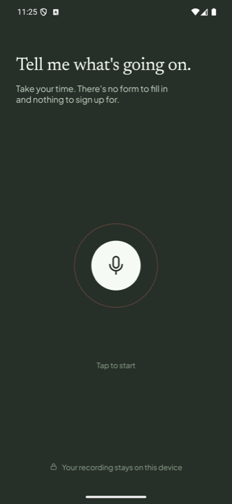
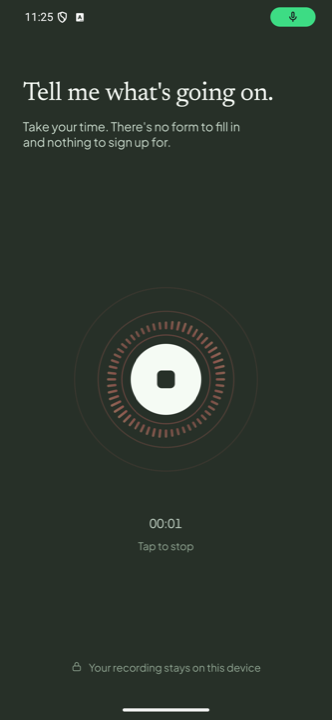
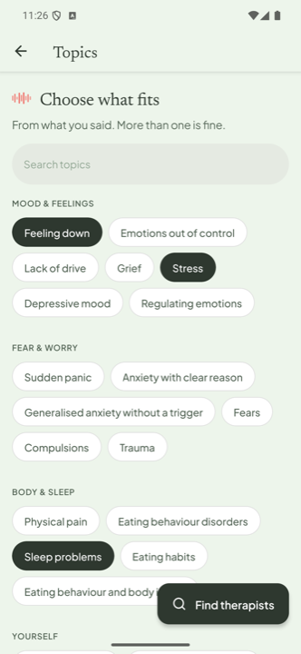
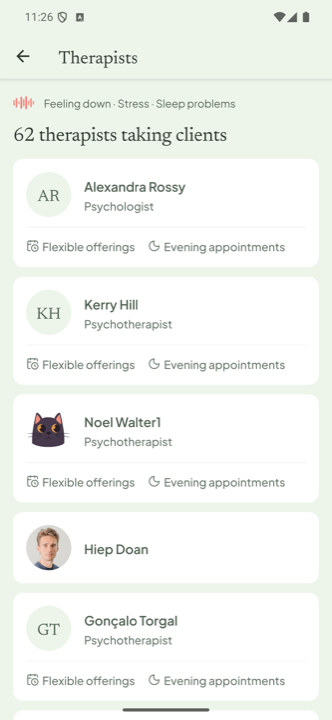

# Nook

Find a therapist by saying what's wrong — record a voice note, pick the topics it
plays back, get practitioners taking clients.

Expo SDK 57 · React 19 · React Native 0.86 · iOS + Android from one codebase.

## Screenshots

**iOS** — iPhone 17 Pro, iOS 26

|                            Record                            |                            Recording                            |                            Choose                            |                            Results                            |
| :----------------------------------------------------------: | :-------------------------------------------------------------: | :----------------------------------------------------------: | :-----------------------------------------------------------: |
|  |  |  |  |

**Android** — Pixel 7 Pro, API 35

|                              Record                              |                              Recording                              |                              Choose                              |                              Results                              |
| :--------------------------------------------------------------: | :-----------------------------------------------------------------: | :--------------------------------------------------------------: | :---------------------------------------------------------------: |
|  |  |  |  |

## Getting started

**Prerequisites** — Node 20+, [Bun](https://bun.sh) 1.3+, Xcode 26 (iOS) or
Android Studio with JDK 17 and an API 34+ emulator.

This is a **development build**, not Expo Go — the app uses Skia,
`expo-glass-effect` and `@expo/ui`, none of which exist in the Go sandbox.

```bash
bun install
cp .env.example .env   # optional — falls back to the dev API when absent
```

### iOS

```bash
bun run ios                          # booted simulator
bun run ios --device "iPhone 17 Pro" # or pick one
```

### Android

```bash
bun run android
```

`ios/` and `android/` are not committed — the first run generates them via
prebuild, which takes a few minutes. Later builds are incremental.

### Scripts

|                     |                                                   |
| ------------------- | ------------------------------------------------- |
| `bun run start`     | Metro only, when the app is already installed     |
| `bun run test`      | 46 unit tests (`bun run test:watch` to watch)     |
| `bun run typecheck` | `tsc --noEmit`                                    |
| `bun run lint`      | ESLint + Prettier (`bun run lint:fix` to fix)     |
| `bun run format`    | Prettier write (`bun run format:check` to verify) |
